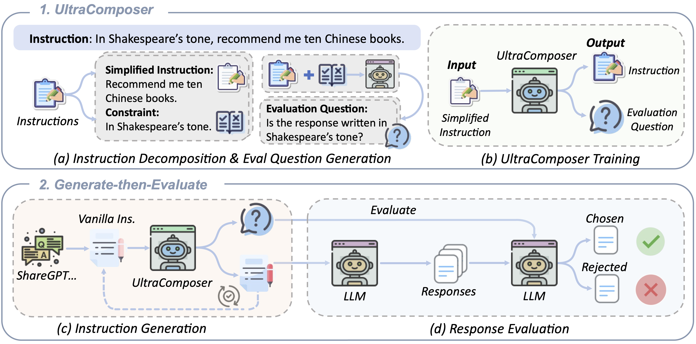

# UltraIF: Advancing Instruction Following from the Wild

## News 🚀
- [04-03] We release our model at HuggingFace 🤗, check out [UltraIF Collection](https://huggingface.co/collections/bambisheng/ultraif-series-67ee75a6042e8ba3e97d0b25) !
  
- [02-10] We release our data at Huggingface: [SFT](https://huggingface.co/datasets/kkk-an/UltraIF-sft-175k) and [DPO](https://huggingface.co/datasets/kkk-an/UltraIF-dpo-20k).

- [02-06] Our paper is public at [arxiv](https://arxiv.org/abs/2502.04153).

## **UltraIF**

ULTRAIF first constructs the **UltraComposer** by decomposing user instructions into simplified ones and constraints, along with corresponding evaluation questions. This specialized composer facilitates the synthesis of instructions with more complex and diverse constraints, while the evaluation questions ensure the correctness and reliability of the generated responses. 

Then, we introduce the **Generate-then-Evaluate** process. This framework first uses UltraComposer to incorporate constraints into instructions and then evaluates the generated responses using corresponding evaluation questions covering various quality levels.



### **UltraComposer**

We have to perpare pair data to train UltraComposer, which inclues `(simplified instruction, original instruction, eval question)`

#### Instruction Decomposition
```
python UltraComposer/extract_constraint.py
```

#### Evaluation Question Generation 
```
python generatte_eval_ques.py

```

Then, we use the pair data to train UltraComposer.


### Training Data
After this, we collect human instructions from exisiting dataset such as ShareGPT, etc, and run 
```
python augment_query.py
python rejection_smapling.py
```
to get the augmented instructions and corresponding responses.

### Model Training

We use Xtuner as our training backbone, experimental details can be found in our paper. 

The command is 
```
xtuner train ./llama31_8b_full.py
```


## Reference
<br> **📑 If you find our projects helpful to your research, please consider citing:** <br>
```
@article{an2025ultraif,
  title={UltraIF: Advancing Instruction Following from the Wild},
  author={An, Kaikai and Sheng, Li and Cui, Ganqu and Si, Shuzheng and Ding, Ning and Cheng, Yu and Chang, Baobao},
  journal={arXiv preprint arXiv:2502.04153},
  year={2025}
}
```

